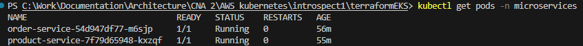
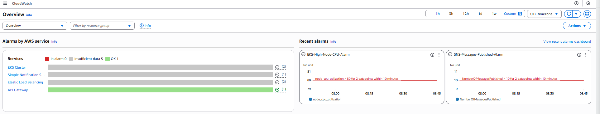
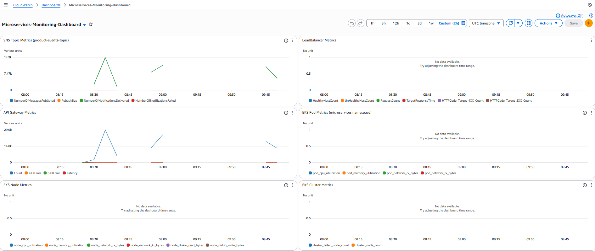
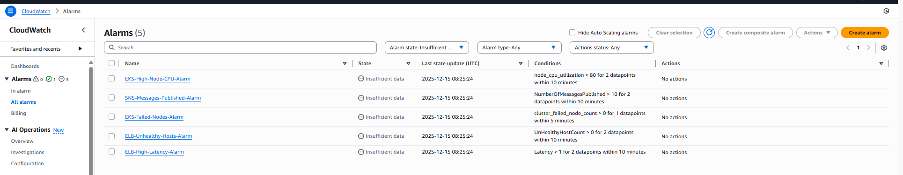
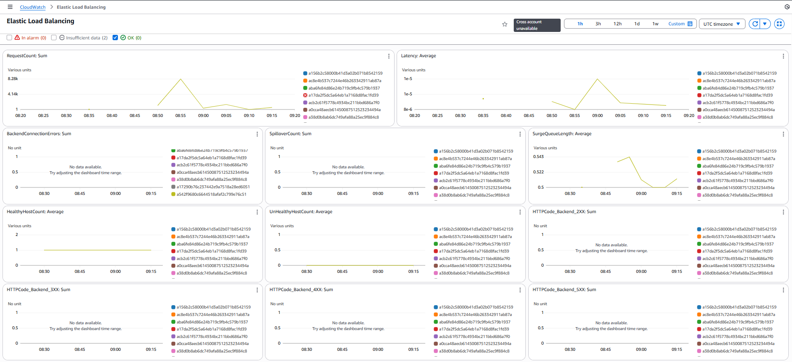
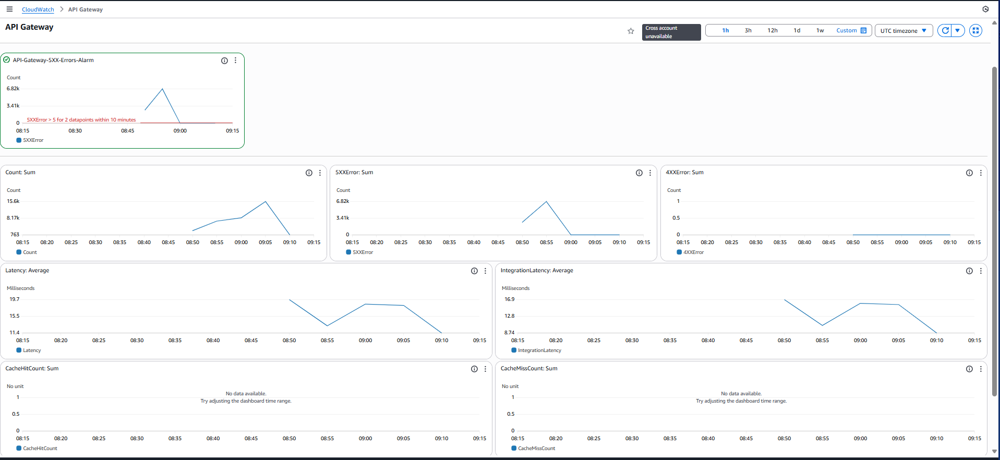
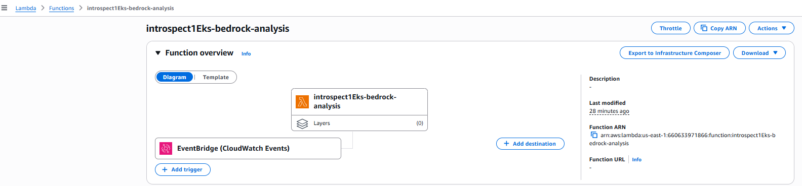
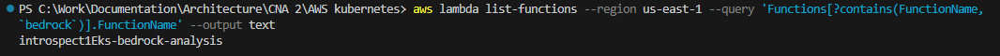

# AWS Kubernetes Microservices Project - Run Guide

This guide provides step-by-step instructions to run the AWS Kubernetes microservices project, including provisioning an EKS cluster, deploying services, and monitoring.


## Prerequisites

- AWS CLI configured with appropriate permissions (e.g., via profile `cna2`).
- Terraform installed (v1.5+).
- kubectl installed.
- GitHub repository access for CI/CD pipelines.
- Java 17 for building services.
- JMeter for load testing (optional).

Ensure your AWS user has the necessary policies attached, such as `TerraformLabPolicy`.

## Project Structure

```
cna2-intr1-devops-repo/
├── terraformEKS/                          # Infrastructure as Code
│   ├── api_gateway.tf                     # API Gateway configuration
│   ├── bedrock.tf                         # Amazon Bedrock AI analysis setup
│   ├── bedrock_lambda.py                  # Lambda function for AI insights
│   ├── dev.tfvars                         # Development environment variables
│   ├── eks.tf                             # EKS cluster configuration
│   ├── locals.tf                          # Local values and tags
│   ├── monitoring.tf                      # CloudWatch monitoring setup
│   ├── outputs.tf                         # Terraform outputs
│   ├── sns.tf                             # SNS/SQS messaging setup
│   ├── variables.tf                       # Terraform variables
│   ├── versions.tf                        # Provider versions
│   └── vpc.tf                             # VPC and networking
├── microservices/                         # Application source code
│   ├── cna2-intr1-order-service/          # Order service (Spring Boot)
│   │   ├── k8s-deployment.yaml           # Kubernetes deployment manifest
│   │   ├── Dockerfile                    # Container build instructions
│   │   ├── pom.xml                       # Maven configuration
│   │   └── src/                          # Java source code
│   ├── cna2-intr1-product-service/        # Product service (Spring Boot)
│   │   ├── k8s-deployment.yaml           # Kubernetes deployment manifest
│   │   ├── Dockerfile                    # Container build instructions
│   │   ├── jmeter_post_products.jmx      # JMeter load testing script
│   │   ├── pom.xml                       # Maven configuration
│   │   └── src/                          # Java source code
│   ├── pubsub-sa.yaml                    # Service account for pub/sub
│   ├── subscription-crd.yaml             # Dapr subscription CRD
│   └── order-subscription.yaml           # Order service subscription
├── documentation/                         # Project documentation
│   ├── README.md                         # This file - setup and run guide
│   ├── Micorservice Deployment Docs.md   # Deployment verification report
│   ├── WORKFLOWS_AND_MONITORING.md       # CI/CD and monitoring guide
│   ├── FurtherStepsAndImprovements.md    # Future enhancements
│   ├── Bedrock CloudWatch Alert Triggering.md # AI analysis documentation
│   └── Architecture_Diagram.drawio # Architecture diagram
├── auto-scripts/                         # Automation scripts
├── .gitignore                            # Git ignore rules
├── LICENSE                               # Project license
└── README.md                             # This file
```

### Key Directories Explained

#### `terraformEKS/` - Infrastructure as Code
Contains all Terraform configurations for provisioning AWS infrastructure:
- **EKS Cluster**: Kubernetes control plane and worker nodes
- **Networking**: VPC, subnets, security groups
- **Messaging**: SNS topics and SQS queues for pub/sub
- **API Gateway**: REST API for external access
- **Monitoring**: CloudWatch dashboards and alarms
- **AI Analysis**: Amazon Bedrock integration for automated insights

#### `microservices/` - Application Code
Source code and deployment manifests for the two Spring Boot microservices:
- **Product Service**: Handles product creation and publishes events to SNS
- **Order Service**: Consumes order messages from SQS
- **Shared Resources**: Service accounts, subscriptions, and CRDs

#### `documentation/` - Project Documentation
Comprehensive documentation covering all aspects of the project:

- **`README.md`**: Complete setup, deployment, and run guide (this file)
- **`Micorservice Deployment Docs.md`**: Detailed deployment verification and status report
- **`WORKFLOWS_AND_MONITORING.md`**: CI/CD pipelines and CloudWatch monitoring setup
- **`FurtherStepsAndImprovements.md`**: Future enhancements and improvement suggestions
- **`Bedrock CloudWatch Alert Triggering.md`**: Amazon Bedrock AI analysis documentation
- **`AWS_Introspect1_Architecture_Diagram.drawio`**: Visual architecture diagram (open in draw.io)

#### `auto-scripts/` - Automation Scripts
Helper scripts for common DevOps tasks and infrastructure management.

### File Naming Convention
- Terraform files: `*.tf` for configurations, `*.tfvars` for variables
- Kubernetes manifests: `k8s-deployment.yaml`
- Documentation: `*.md` for Markdown files
- Scripts: `*.sh` for bash, `*.cmd` for Windows batch

## 1. Setup and Initialization

### Clone or Navigate to the Project Directory
```bash
cd "C:\Work\Documentation\Architecture\CNA 2\AWS kubernetes\introspect1"
```

### Initialize Terraform
```bash
cd terraformEKS
terraform init
```

### Validate and Plan Terraform Deployment
```bash
terraform fmt -recursive
terraform validate
terraform plan -var-file=dev.tfvars -out=plan.out
terraform show -json plan.out > plan.json
```

## 2. Provisioning the Infrastructure

### Prerequisites
- AWS CLI configured with appropriate permissions
- Terraform installed (v1.5+ recommended)
- kubectl installed

### Set AWS Profile
```powershell
$env:AWS_PROFILE = "cna2"
```

### Initialize Terraform
Navigate to the terraformEKS directory and run initialization:
```bash
cd terraformEKS
aws_terraform_init.sh
terraform init
```

### Plan and Apply Infrastructure
Review the planned changes:
```bash
terraform plan --var-file=dev.tfvars
```

**Note:** Provisioning typically takes 15–20 minutes.

### Configure kubectl
Update kubeconfig to connect to the EKS cluster:
```bash
aws eks update-kubeconfig --name introspect1Eks --region us-east-1 --profile cna2
```

Verify the cluster:
```bash
kubectl get nodes -o wide
kubectl get ns
```

### Deploy Supporting Kubernetes Resources
Create the microservices namespace:
```bash
kubectl create namespace microservices
kubectl get ns
```

Apply pub/sub service account and subscription CRD:
```bash
kubectl apply -f ../microservices/pubsub-sa.yaml
kubectl apply -f ../microservices/subscription-crd.yaml
kubectl apply -f ../microservices/order-subscription.yaml
```

### Configure SNS-SQS Subscription
Subscribe the order service queue to the product events topic:
```bash
aws sns subscribe --topic-arn arn:aws:sns:us-east-1:660633971866:product-events-topic --protocol sqs --notification-endpoint arn:aws:sqs:us-east-1:660633971866:order-service-queue
```

### Deploy Microservices via CI/CD
Run the GitHub Actions pipelines for the Orders and Products microservices to deploy them to the cluster.

### Configure API Gateway
After microservices are deployed, get the product service LoadBalancer hostname:
```bash
kubectl get svc product-service -n microservices -o jsonpath='{.status.loadBalancer.ingress[0].hostname}'
```

Update the `api_gateway.tf` file with the hostname
Update the `monitoring.tf` file with the hostname
```bash
terraform apply --var-file=dev.tfvars
```

Get the API Gateway URL:
```bash
terraform output api_gateway_url
```


### Verification
Verify all resources are deployed correctly:
```bash
kubectl get all -n microservices
kubectl get subscriptions -n microservices
```



## 3. Deploying Microservices

### Create Microservices Namespace
```bash
kubectl create namespace microservices
```

### Deploy Service Accounts and Subscriptions
```bash
kubectl apply -f "../microservices/pubsub-sa.yaml"
kubectl apply -f "../microservices/subscription-crd.yaml"
kubectl apply -f "../microservices/order-subscription.yaml"
```

### Subscribe SQS to SNS (Manual Step)
```bash
aws sns subscribe --topic-arn arn:aws:sns:us-east-1:660633971866:product-events-topic --protocol sqs --notification-endpoint arn:aws:sqs:us-east-1:660633971866:order-service-queue
```

### Deploy Services via GitHub Actions
- Push code to the repository to trigger CI/CD pipelines for product-service and order-service.
- Pipelines will build JARs, create Docker images, push to ECR, and deploy to EKS.

### Manual Deployment (Alternative)
If not using CI/CD:
1. Build and push images manually.
2. Apply Kubernetes manifests:
   ```bash
   kubectl apply -f "../microservices/cna2-intr1-product-service/k8s-deployment.yaml"
   kubectl apply -f "../microservices/cna2-intr1-order-service/k8s-deployment.yaml"
   ```

### Verify Deployments
```bash
kubectl get pods -n microservices
kubectl get svc -n microservices
```

## 4. Testing and Monitoring

### Test Product Service
Port-forward and test:
```bash
kubectl port-forward svc/product-service 8080:80 -n microservices
curl -X POST http://localhost:8080/products -H "Content-Type: application/json" -d '{"name": "Test Product", "description": "Test Description"}'
```

### Load Testing with JMeter
Run stress tests:
```bash
jmeter -n -t "../microservices/cna2-intr1-product-service/jmeter_post_products.jmx" -l results.jtl
```


### Monitor with CloudWatch
- Access the `Microservices-Monitoring-Dashboard` in AWS CloudWatch.
- Check SNS metrics for message flow, ELB for health, and EKS for resource usage.
- View logs via `kubectl logs` or set up Fluent Bit for CloudWatch integration.







### API Gateway Endpoint
Get the API Gateway URL:
```bash
terraform output api_gateway_url
```

Test via the gateway:
```bash
curl -X POST "<api_gateway_url>/products" -H "Content-Type: application/json" -d '{"name": "Test", "description": "Via Gateway"}'
```

### AI Analysis with Amazon Bedrock
The project includes automated AI analysis of CloudWatch logs and alerts using Amazon Bedrock.




## 5. Debugging and Logs

### Common Commands
- Check pod status: `kubectl get pods -n microservices`
- View logs: `kubectl logs <pod-name> -n microservices`
- Describe resources: `kubectl describe pod <pod-name> -n microservices`

### Rollback or Updates
- For Dapr-related issues: `kubectl rollout restart deployment product-service -n microservices`
- Update deployments: Modify YAMLs and reapply with `kubectl apply -f <file>`

## 6. Cleanup

### Destroy Infrastructure
To avoid costs, destroy all resources:
```bash
terraform destroy -var-file=dev.tfvars
```

### Remove Local Resources
Delete namespaces and clean up:
```bash
kubectl delete namespace microservices
```

## Notes
- Ensure AWS credentials are set for the `cna2` profile.
- If using Dapr, label the namespace: `kubectl label namespace microservices dapr.io/enabled=true --overwrite`
- For autoscaling or additional features, refer to Terraform variables in `dev.tfvars`.
- Contact the team for issues with IAM permissions or resource limits.

This setup enables a fully functional microservices architecture on AWS EKS with pub/sub messaging, monitoring, and CI/CD.